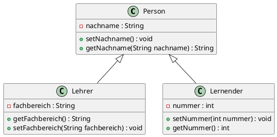

# Lektionen 3 und 4
>* Diese Woche haben wir uns mit praktischen Beispielen zur Vererbung beschäftigt.

## Vererbung mit Superklasse (BZT2)

In den nächsten Code-Beispielen werden wir das Programm BZT1 durch die Vererbung erweitern und es unter  BZT2 speichern.

>* Implementierung einer neuen Klasse Person als Superklasse
```
public class Person {
    private String nachname;

    public String getNachname(String nachname){
        return nachname;
    }

    public void setNachname(){
        this.nachname = nachname;
    }
}
```
> [!NOTE|style:flat]
> Jetzt kann man in den Klassen Lehrer und Lernender den String nachname sowie die SETTER und GETTER entfernen.

>* Jetzt werden wir die Klassen Lehrer und Lernender zu Subklassen der Superklasse Person machen, mit dem Keyword extends.
```
 public class Lehrer extends Person
{
    private String fachbereich = new String();
    
    public void setFachbereich(String fachbereich)
    {
        this.fachbereich = fachbereich;
    }
    
    public String  getFachbereich()
    {
        return fachbereich;
    }
}
```
>* Klasse Lernender
```
public class Lernende extends Person
{
    private int nummer;  // Schülernummer
    
    public void setNummer(int nummer)
    {
        this.nummer = nummer;
    }
    
    public int getNummer()
    {
        return nummer;
    }  
}
```
>* Hierarchie als Diagramm
